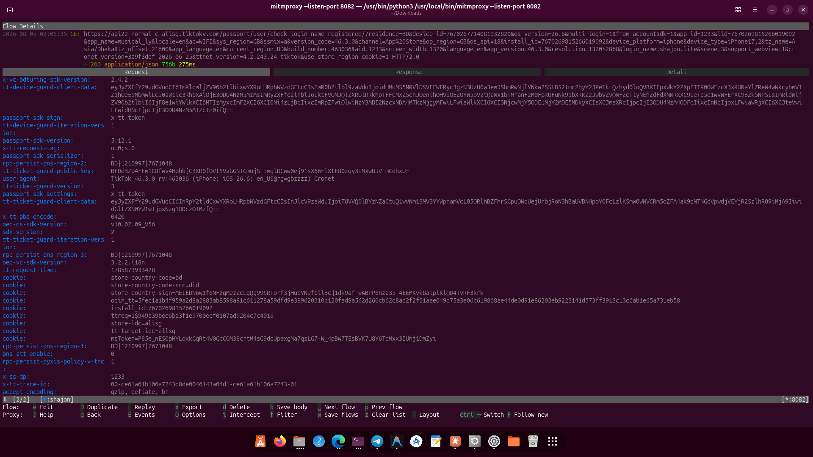
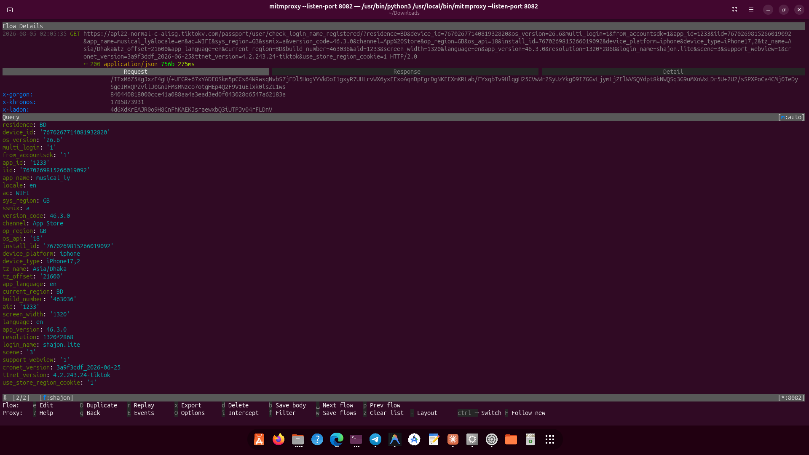

# 🔐 iOS-TikTok-SSL-Pinning-Bypass
📡 Intercept TikTok network traffic on iOS/iPad OS device.

> 💡 **GOOD NEWS:** You do **not** need a jailbroken device to use this! It works flawlessly on **non-jailbroken** devices and has been successfully tested using **Mitmproxy**.

## 📌 Latest Bypassed and Tested App Details
- App version: **46.3.0**
- Tools Used for test: [Mitmproxy](https://mitmproxy.org/), [Reqable](https://reqable.com/).
- For any inquiries, please contact me on Telegram [https://t.me/SHAJON](https://t.me/SHAJON)

## 🎥 Evidence

## ✅ Other Apps
1. [Facebook Android](https://github.com/shajon-dev/Facebook-SSL-Pinning-Bypass)
2. [Facebook iOS](https://github.com/shajon-dev/iOS-Facebook-SSL-Pinning-Bypass)
3. [Messenger Android](https://github.com/shajon-dev/Messenger-SSL-Pinning-Bypass)
4. [Messenger iOS](https://github.com/shajon-dev/iOS-Messenger-SSL-Pinning-Bypass)
5. [Instagram Android](https://github.com/shajon-dev/Instagram-SSL-Pinning-Bypass)
6. [Instagram iOS](https://github.com/shajon-dev/iOS-Instagram-SSL-Pinning-Bypass)
7. [Threads Android](https://github.com/shajon-dev/Threads-SSL-Pinning-Bypass)
8. [Threads iOS](https://github.com/shajon-dev/iOS-Threads-SSL-Pinning-Bypass)
9. [Business Suite Android](https://github.com/shajon-dev/Meta-Business-Suit-SSL-Pinning-Bypass)
10. [Business Suite iOS](https://github.com/shajon-dev/iOS-Meta-Business-Suit-SSL-Pinning-Bypass)

## 📦 For Demo - Download Modified IPA
  - For any issues, contact me on Telegram. Read [setup process](#-setup-process) carefully before use.
  - Please note that the latest version is a paid release and is not available for free download.
  - Check the **Releases** section for the free version or click download link below.
<table width="100%">
  <thead>
    <tr>
      <th align="center">Package Name</th>
      <th align="center">Version</th>
      <th align="center">Status</th>
      <th align="center">Non-Jailbreak</th>
      <th align="center">Download link</th>
    </tr>
  </thead>
  <tbody>
    <tr>
      <td align="center"><code>com.zhiliaoapp.musically</code></td>
      <td align="center">46.3.0</td>
      <td align="center">✅ Bypassed</td>
      <td align="center">✅ Yes</td>
      <td align="center"><a href="https://t.me/SHAJON">Contact Telegram</a></td>
    </tr>
  </tbody>
</table>

## 📱 Requirements
1. 🔓 iPhone / iPad [No need jailbroken device]
2. 🔄 Tools for traffic capture: [Mitmproxy](https://mitmproxy.org/), [Reqable](https://reqable.com/).

## 🔧 Setup Process
 1. 🔄 **Install Modified IPA** via [Feather](https://github.com/CLARATION/Feather) or [Ksign](https://github.com/Nyasami/Ksign).
 2. 💀 Use your personal certificate. Do NOT use public iOS IPA signing certificates.
 3. 📊 Use any packet capture tool to monitor TikTok network traffic.

## 💼 Professional Services & Custom Solutions

Are you looking for the **latest patched IPAs** or require specialized technical services? I offer professional, reliable solutions tailored to your needs. 

**My Expertise Includes:**
- 🔐 **SSL Pinning Bypass:** Custom bypass solutions for both Android and iOS applications.
- 🔄 **Reverse Engineering:** Comprehensive analysis and reverse engineering of any Software, Mobile App, or API.
- 🤖 **Bot Development:** Creation of advanced, automated bots for various platforms and customized use cases.

If a specific bypass is not available on my GitHub, or if you have a custom project in mind, let's connect! I am highly active and ready to discuss your requirements.

  

## ☕ Buy Me a Coffee

If this project helped you, consider **buying me a coffee** — it keeps these bypasses alive and updated! ❤️

| Coin | Network | Address |
| :---: | :--- | :--- |
|  | Binance Pay (UID) | <pre><code>839622149</code></pre> |
|  | TRC20 [TRX Network] | <pre><code>TAsPdCxkX9CeErJ4vw7xBHfZDT6vpdfmwH</code></pre> |
|  | ETH / BSC | <pre><code>0x22d4f314acbf6055b0a37df8df68f9cd40ba889a</code></pre> |
|  | Bitcoin Network | <pre><code>14RYf4pw7v2rtttLxRch2StjFzFAn9ycCE</code></pre> |
